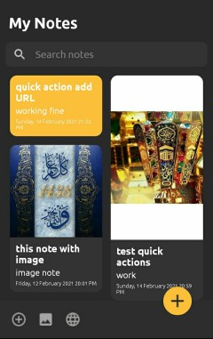

# Notes Android Application
It's one of the most powerful tools around to handle notes . You can add text notes, images, and websites, and You can search for notes.

 

## Overview
* The application has two Activities.
* First Activity shows your notes and you can search for any note you want , if you click on any note you can update it and you can delete it.
* It has a button to add new note, bar for quick action such as add note , add image , and add URL.
* Second Activity for new note includes title ,subtitle, date time ,image , URL ,and note body.  

## Technologies
* Java as development programming language.
* Android Studio as development environment.